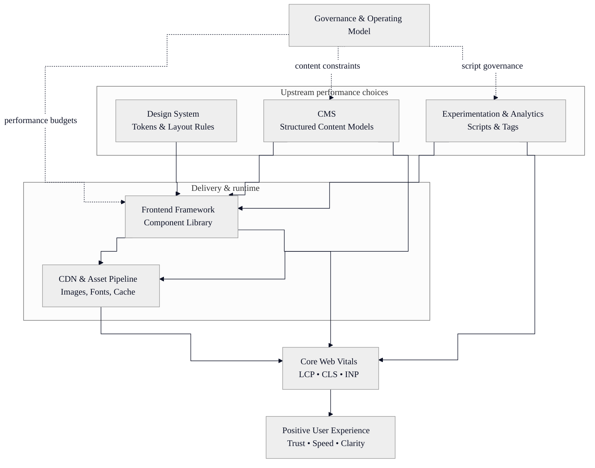

# EPIC TEMPLATE
# Sugartown — Claude Code Epic Prompt

---

## Epic Lifecycle

**Linear Issue:** [SUG-13](https://linear.app/sugartown/issue/SUG-13/mermaid-diagram-section-type)

## EPIC NAME: Mermaid Diagram Section Type

---

## Pre-Execution Completeness Gate

- [x] **Interaction surface audit** — No existing diagram/chart section exists in `schemas/sections/`. No Mermaid rendering exists in `PageSections.jsx` or `src/design-system/`. The closest existing section types are `htmlSection` (raw HTML, no JS) and `textSection` (PortableText). This is a net-new section type; no existing component covers 80%+ of the use case.
- [x] **Use case coverage** — Single consumer: `PageSections.jsx` renders section via switch case. Editor enters Mermaid markup in a code textarea field in Studio; frontend renders the diagram as SVG via the `mermaid` library. Supported diagram types: flowchart, sequence, class, state, ER, Gantt, pie, mindmap, timeline. No interactive editing on the frontend — render-only.
- [x] **Layout contract** — Diagram renders inside the section layout contract (`padding-block` only in detail context; no own `max-width`/`padding-inline` when `context="detail"`). SVG output is centered, `max-width: 100%` with `overflow-x: auto` for wide diagrams. No fixed-width constraint — diagram adapts to container.
- [x] **All prop value enumerations** — No enum/select fields on this section type.
- [x] **Correct audit file paths** — Verified: `apps/studio/schemas/sections/` (dir exists), `apps/studio/schemas/index.ts`, `apps/web/src/components/PageSections.jsx`, `apps/web/src/components/PageSections.module.css`, `apps/web/src/lib/queries.js`
- [x] **Dark / theme modifier treatment** — Mermaid supports a `theme` init parameter. The renderer will detect `[data-theme]` on `<html>` and pass `theme: 'dark'` (dark/default) or `theme: 'neutral'` (light). Brand colours (Sugartown Pink `#FF247D`, midnight `#0D1226`) injected via `themeVariables` override. Editor-supplied `%%{init}` blocks are respected if present — they override the auto-theme.
- [x] **Studio schema changes scoped** — Yes, in scope. New section schema: `mermaidSection.ts`. Commit prefix: `feat(studio):` for the schema, then component work in a follow-up commit within the same epic.
- [x] **Web adapter sync scoped** — No DS-level component created. The Mermaid renderer is a page-level sub-component inside `PageSections.jsx` (same pattern as `HtmlSection`, `CalloutSection`). No web adapter sync needed.

---

## Context

**Existing infrastructure:**
- Section builder: 7 section types (`hero`, `textSection`, `imageGallery`, `ctaSection`, `htmlSection`, `cardBuilderSection`, `calloutSection`)
- `PageSections.jsx` switch renders sections; CSS in `PageSections.module.css`
- All four slug queries project `sections[]` with conditional `_type ==` projections
- Content already uses Mermaid-style diagrams (e.g. the Core Web Vitals article has a flowchart) — currently embedded as raw HTML or static images

**Motivation:**
Editors need to embed data flow diagrams, architecture charts, and process maps into articles, nodes, and case studies. Mermaid is a widely-adopted text-to-diagram format that editors can author in plain text. The section type gives Studio a code input with live preview, and the frontend renders the diagram as themed SVG.

---

## Objective

After this epic, editors can add a **Mermaid Diagram** section to any page, article, case study, or node. The section provides a code textarea in Studio where editors paste Mermaid markup. On the frontend, the markup is rendered client-side as an inline SVG that respects the active colour theme (dark/light) and brand palette. An optional caption field provides accessible context beneath the diagram.

---

## Doc Type Coverage Audit

| Doc Type    | In scope? | Reason if excluded |
|-------------|-----------|-------------------|
| `page`      | ☑ Yes | Pages use `sections[]` — diagrams valid for landing/service pages |
| `article`   | ☑ Yes | Articles already contain inline diagrams as static HTML |
| `caseStudy` | ☑ Yes | Architecture/process diagrams are relevant to case studies |
| `node`      | ☑ Yes | Knowledge graph nodes frequently reference system diagrams |
| `archivePage` | ☐ No | Archive pages render listings, not content sections |

---

## Scope

- [x] Studio schema: create `mermaidSection.ts` with `code` (text field) and `caption` (string field)
- [x] Schema registration: import and add to `schemaTypes` in `index.ts`
- [x] Document wiring: add `defineArrayMember({type: 'mermaidSection'})` to `sections[]` in `page.ts`, `article.ts`, `caseStudy.ts`, `node.ts`
- [x] GROQ query projections: add `_type == "mermaidSection" => { code, caption }` to all four slug queries
- [x] Frontend renderer: `MermaidDiagram` sub-component in `PageSections.jsx`
- [x] CSS styles: `.mermaidSection` in `PageSections.module.css`
- [x] Runtime dependency: add `mermaid` to `apps/web/package.json`
- [ ] ~~Migration script~~ — N/A, no existing content to backfill (editors create new sections)

---

## Query Layer Checklist

- [ ] `pageBySlugQuery` — add `_type == "mermaidSection" => { code, caption }`
- [ ] `articleBySlugQuery` — add `_type == "mermaidSection" => { code, caption }`
- [ ] `caseStudyBySlugQuery` — add `_type == "mermaidSection" => { code, caption }`
- [ ] `nodeBySlugQuery` — add `_type == "mermaidSection" => { code, caption }`
- [ ] Archive queries — excluded: diagrams are not rendered on archive cards

---

## Schema Enum Audit

No enum fields on this section type. N/A.

---

## Metadata Field Inventory

Not applicable — this epic does not touch MetadataCard or metadata surfaces.

---

## Themed Colour Variant Audit

| Surface / component | Dark | Light | Pink Moon | Token(s) / implementation |
|---------------------|------|-------|-----------|--------------------------|
| Diagram background | transparent (inherits page bg) | transparent | transparent | No token — Mermaid SVG bg set to `transparent` |
| Node fills | `#1e1b4b` (midnight-ish) / brand pink accents | `#F5F6F8` (softgrey) / brand pink accents | Inherits dark | Mermaid `themeVariables` set at render time |
| Edge/line colour | `var(--st-color-brand-primary)` / `#FF247D` | `#0D1226` (midnight) | Inherits dark | Mermaid `themeVariables.lineColor` |
| Text colour | `var(--st-color-text-default)` | `var(--st-color-text-default)` | Inherits dark | Mermaid `themeVariables.textColor` |
| Caption text | `var(--st-color-text-secondary)` | `var(--st-color-text-secondary)` | Inherits | Standard token inheritance |

**Note:** If the editor's Mermaid code includes a `%%{init}` block with custom theme variables (as in the example diagram), those take precedence over the auto-theme. This is intentional — editors who customize styling should get what they asked for.

---

## Non-Goals

- **Studio live preview of Mermaid** — Studio will show the raw code in a textarea, not a rendered preview. A custom Studio input component with live preview is a potential follow-on but out of scope for this epic.
- **Server-side rendering** — Mermaid renders client-side only. SSR/pre-rendering of diagrams is deferred (would require puppeteer or @mermaid-js/mermaid-cli in a build step).
- **Interactive diagrams** — No click/hover/zoom interactions. Rendered SVG is static.
- **Diagram editing on the frontend** — The Mermaid code is author-time only (Studio). No frontend code editor.
- **DS package component** — The renderer lives in `PageSections.jsx` as a sub-component. No DS-level `MermaidDiagram` component is created (same pattern as `HtmlSection`).

---

## Technical Constraints

**Monorepo / tooling**
- `mermaid` npm package added to `apps/web/package.json` (not monorepo root)
- Mermaid is ~2MB bundled — use dynamic `import('mermaid')` to code-split it. Only load when a `mermaidSection` is present on the page.
- No migration script needed.

**Schema (Studio)**
- `mermaidSection.ts` — object schema with two fields:
  - `code` — type: `text`, rows: 15, title: "Mermaid Code", description: "Paste Mermaid diagram markup. See mermaid.js.org/syntax for reference."
  - `caption` — type: `string`, title: "Caption", description: "Optional caption displayed below the diagram."
- Studio icon: use `@sanity/icons` — `BlockElementIcon` or `ComponentIcon`
- Preview: show first 80 chars of `code` field as subtitle

**Query (GROQ)**
- Minimal projection: `_type == "mermaidSection" => { code, caption }`
- Added to: `pageBySlugQuery`, `articleBySlugQuery`, `caseStudyBySlugQuery`, `nodeBySlugQuery`

**Render (Frontend)**
- `MermaidDiagram` sub-component inside `PageSections.jsx`:
  1. `useEffect` with dynamic `import('mermaid')` on mount
  2. Detect current theme from `document.documentElement.getAttribute('data-theme')`
  3. Call `mermaid.initialize()` with appropriate theme config
  4. Call `mermaid.render()` with the editor's code string
  5. Insert resulting SVG into a container div via `dangerouslySetInnerHTML`
  6. Re-render on theme change (listen to `MutationObserver` on `data-theme` attribute)
- Security note: Mermaid's `render()` produces sanitized SVG (no script injection). The `securityLevel: 'strict'` config option will be set explicitly.
- Null guard: if `code` is empty/undefined, render nothing (not an error state)
- Error handling: if Mermaid parsing fails, render a styled error message (mono font, code block style) showing the parse error — don't crash the page

**Design System → Web Adapter Sync**
- Not applicable — no DS component created. Renderer is page-level only.

---

## Files to Modify

**Studio**
- `apps/studio/schemas/sections/mermaidSection.ts` — CREATE
- `apps/studio/schemas/index.ts` — add import + register
- `apps/studio/schemas/documents/page.ts` — add `defineArrayMember({type: 'mermaidSection'})` to `sections[]`
- `apps/studio/schemas/documents/article.ts` — add to `sections[]`
- `apps/studio/schemas/documents/caseStudy.ts` — add to `sections[]`
- `apps/studio/schemas/documents/node.ts` — add to `sections[]`

**Frontend**
- `apps/web/package.json` — add `mermaid` dependency
- `apps/web/src/lib/queries.js` — add projection to 4 slug queries
- `apps/web/src/components/PageSections.jsx` — add `case 'mermaidSection'` + `MermaidDiagram` sub-component
- `apps/web/src/components/PageSections.module.css` — add `.mermaidSection`, `.mermaidCaption`, `.mermaidError` styles

---

## Deliverables

1. **Schema** — `mermaidSection.ts` exists in `schemas/sections/`, registered in `index.ts`, with `code` (text) and `caption` (string) fields
2. **Document wiring** — `sections[]` in `page`, `article`, `caseStudy`, `node` includes `defineArrayMember({type: 'mermaidSection'})`
3. **GROQ projections** — all 4 slug queries include `_type == "mermaidSection" => { code, caption }`
4. **Renderer** — `PageSections.jsx` has `case 'mermaidSection'` rendering a `MermaidDiagram` component that dynamically imports `mermaid` and renders SVG
5. **Theme-aware** — diagram auto-themes based on `[data-theme]` attribute; editor `%%{init}` overrides are respected
6. **Error handling** — invalid Mermaid syntax shows a styled error message, does not crash the page
7. **Code-split** — `mermaid` library only loads when a page contains a `mermaidSection` (dynamic import)

---

## Acceptance Criteria

- [ ] `tsc --noEmit` in `apps/studio` reports zero new errors
- [ ] Studio hot-reloads without errors; "Mermaid Diagram" section type appears in the section builder for page, article, caseStudy, and node doc types
- [ ] Frontend: create a test document with the example flowchart from the epic brief → diagram renders as SVG, not raw text
- [ ] Dark theme: diagram renders with dark-appropriate colours (not white-on-white or invisible elements)
- [ ] Light theme: toggling theme re-renders the diagram with light-appropriate colours
- [ ] Editor `%%{init}` overrides: a diagram with custom `themeVariables` (like the example in Context) renders using the editor's colours, not the auto-theme
- [ ] Empty `code` field: section renders nothing (no error, no empty container)
- [ ] Invalid Mermaid syntax: a styled error message appears instead of a crash; rest of the page renders normally
- [ ] Code splitting: `mermaid` chunk does NOT appear in the initial bundle; it loads only on pages with a `mermaidSection` (verify via Network tab or `vite build --report`)
- [ ] GROQ projection test: query a document with a `mermaidSection` → `code` and `caption` fields returned correctly
- [ ] Caption: when provided, renders below the diagram as secondary text
- [ ] Diagram is centered within the section container and does not cause page-level horizontal scrollbar (`max-width: 100%`, `overflow-x: auto` on the SVG container)
- [ ] **Section layout contract**: diagram section respects `padding-block` only in detail context; no own `max-width`/`padding-inline` override
- [ ] **Visual QA**: render the example flowchart on a real article page, adjacent to text sections. Verify spacing, alignment, and that the diagram doesn't collide with or overlap neighbouring sections. Check at desktop and mobile breakpoints.

---

## Risks / Edge Cases

**Schema risks**
- [ ] `code` field name — does not collide with existing fields on parent doc types (sections are objects with isolated namespaces)
- [ ] No cross-doc references — self-contained section

**Query risks**
- [ ] All four slug queries updated — enforced by Query Layer Checklist
- [ ] Archive queries intentionally excluded — diagrams don't appear on cards

**Render risks**
- [ ] `mermaid` package is ~2MB — mitigated by dynamic import / code-splitting
- [ ] Mermaid's `render()` is async — component must handle loading state (brief flash before SVG appears)
- [ ] Very large/complex diagrams may render slowly — no mitigation in V1; monitor if editors report issues
- [ ] `dangerouslySetInnerHTML` used for SVG output — Mermaid's built-in sanitizer + `securityLevel: 'strict'` mitigates XSS. The `code` field is author-controlled (Studio only), not user-submitted
- [ ] Theme change re-render: `MutationObserver` on `document.documentElement` for `data-theme` attribute changes — must clean up observer on unmount
- [ ] Multiple Mermaid sections on one page: each must have a unique render ID (use `_key` from Sanity section data)

**Example Mermaid code for testing:**

---

## Post-Epic Close-Out

1. **Activate the epic file**: assign next EPIC number, move to `docs/prompts/`, update Epic ID
2. **Confirm clean tree** — `git status` clean
3. **Run mini-release** — `/mini-release EPIC-NNNN Mermaid Diagram Section Type`
4. **Start next epic** — only after mini-release commit is confirmed
