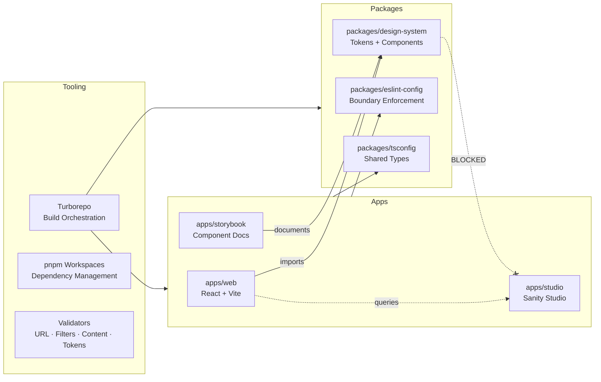
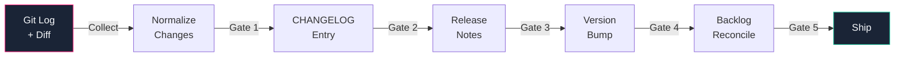
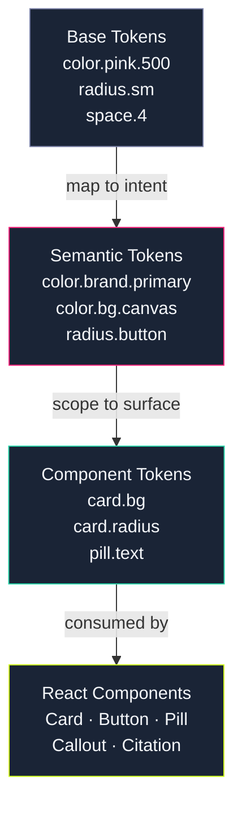

# Platform Page Content Brief

**Route:** `/platform`
**Sanity type:** `page` document via section builder
**Status:** Draft brief, ready for copy authoring
**Source constraints:** IA Brief §5.3 (Platform), §10 Decision #3, Brand Voice Guide, Master Voice Cheat Sheet
**Created:** 2026-04-15

---

## What This Document Is

A section-by-section content brief for the Sugartown Digital platform page. This page is **the differentiator**. Most PM portfolios are static brochures. This one has a changelog, a design system PRD, an interactive schema explorer, enforced architectural boundaries, and a release assistant prompt that governs how documentation gets written. The Platform page is where that stops being invisible infrastructure and becomes visible social proof.

**Option A (site-as-platform) is the framing.** The page positions sugartown.io itself as the primary case study: a governed, versioned, composable product built with the same discipline Bex applies to client work. Every section cross-references real, shipped artifacts.

---

## Why This Page Matters

The IA Brief's visitor experience arc runs: Land → See polished Work → Notice Release Notes → Realize this portfolio ships versions → Click Architecture → Understand you treat content like code → Hire you.

The Platform page is the pivot. It's the moment a technical hiring manager stops scanning and starts reading. A non-technical hiring manager should still understand the *shape* of the work (structured, versioned, governed) even if they skip the details.

---

## Voice Dial

**Platform / product layer:** Confident, precise, systems-thinking register. Not a marketing page. Not a technical deep-dive. The tone sits between a well-written README and a Stripe architecture overview. Let the artifacts speak; the copy points at them.

Per the Brand Voice Guide tone spectrum: "The site speaks first, you speak second." On the Platform page, the *system* speaks first.

**Anti-patterns to avoid on this page specifically:**
- No "I built this cool thing" energy (the structure proves it)
- No "robust, scalable, and maintainable" adjective triads
- No apologizing for the site being a portfolio ("it's just a personal project")
- No overselling the stack ("cutting-edge MACH architecture")
- No em dashes, no decorative emoji
- No future-tense promises ("we plan to add..."). The "Not in this release" convention from the Release Assistant Prompt applies: deferrals are stated as facts, not roadmap promises

---

## Governance Artifact Inventory (What Exists to Cross-Reference)

Before writing copy, know what's real and shipped. Every claim on this page must link to an artifact that exists.

| Artifact | Location / Route | Status | What It Proves |
|----------|-----------------|--------|----------------|
| CHANGELOG.md | `docs/CHANGELOG.md` (repo) | Shipped, maintained | Versioned releases with SemVer |
| Release Notes (per version) | `docs/release-notes/RELEASE_NOTES_vX.Y.Z.md` | Shipped, 6+ versions | Narrative documentation per release |
| Release Assistant Prompt | `docs/release-assistant-prompt.md` | Shipped | Governed, gated release process with human-in-the-loop |
| Design System PRD v2.0 | `docs/briefs/design-system/design-system-prd.md` | Active | Three-layer token architecture, component contracts, accessibility governance |
| Monorepo PRD | `docs/briefs/monorepo-prd.md` | Active | MACH principles, boundary enforcement, migration strategy |
| IA Brief | `docs/briefs/ia-brief.md` | Locked constraint doc | Information architecture decisions, phase gates |
| Schema ERD Explorer | `/platform/schema` (live page) | Shipped (v0.17.3) | 30 entities, 44 relationships, interactive visualization |
| Architectural Boundary Rules | `packages/eslint-config/boundaries.js` | Enforced | Lint-level enforcement of import boundaries |
| URL Validator | `pnpm validate:urls` | Enforced | Route namespace protection |
| Filter Model Validator | `pnpm validate:filters` | Enforced | Archive filter contract validation |
| Content State Validator | `pnpm validate:content` | Enforced | Draft-shadow detection, field completeness |
| Token Reference Validator | `pnpm validate:tokens` | Enforced | Broken CSS custom property detection |
| Content State Governance | `apps/web/src/lib/contentState.js` | Shipped (v0.17.7) | Published-only content posture, build-time safety plugin |
| Brand Voice Guide | `docs/brand-voice-guide.md` | Active | Copy governance with anti-AI-generated checklist |
| Epic Template | `docs/epic-template.md` | Active | Standardized epic format with confirmation gates |
| Backlog Priorities | `docs/backlog/sugartown-backlog-priorities.html` | Maintained | Prioritized, version-tagged, date-stamped |

---

## Section Layout (Top → Bottom)

### 1. Hero Section

**Section type:** `heroSection`
**Purpose:** The "wait, this portfolio ships versions?" moment. Arrest, differentiate, set the register.

**Content direction:**

- **Heading:** Declarative. Names the behavior, not the section. The IA Brief suggested "Sugartown ships versions. Here's how." That's the right register. Alternatives: "This site is a product." / "Built like a platform. Because it is one."
- **Subheading:** One sentence grounding the heading in specifics. Name the stack without listing every dependency. Communicate: monorepo, versioned, governed, CMS-agnostic by design.
- **CTA button(s):** One primary. "Explore the schema" → `/platform/schema` (the ERD is the most visual proof point). Optional secondary: "Read the changelog" → anchor link or external to repo.

**Hero background direction:** The hero should use an architectural/structural visual treatment rather than a photographic hero. Options for a generated or composed background:
- A subtle, low-opacity rendering of the monorepo workspace diagram (the `apps/` + `packages/` tree)
- A stylized version of the architecture flow diagram (see Mermaid Diagram A below)
- An abstract circuit-board or node-graph pattern in brand colors (midnight, pink accents, seafoam connection lines) that evokes architecture without being literal

The hero image should be **Mode A (no text)** per the image generation template convention, with typography overlaid separately by the frontend. Dark background treatment (midnight base) with structural accent lines in pink/seafoam.

**Tone:** The version number is the flex; the copy just points at it.

---

### 2. Architecture Overview

**Section type:** `textSection` + embedded diagram (via `htmlSection` or image)
**Purpose:** Show the shape of the system. Not a tutorial. A hiring manager should look at this for 10 seconds and understand: this person built a real, governed, composable system.

**Content direction:**

- **Section heading:** "Architecture" or "How it's built" or "System architecture"
- **Body copy:** 3–4 sentences max. Name the three layers: apps (web, studio, storybook), packages (design-system, shared config), tooling (Turborepo, pnpm, validators). Emphasize the *boundary enforcement* as the differentiator: packages can't import from apps, the design system can't import CMS libraries. This isn't just a folder structure; it's a governed dependency graph.
- **Proof point:** "Architectural boundaries are enforced at lint time. If the design system tries to import from Sanity, the build fails." One sentence that proves this isn't aspirational.
- **CTA:** "See the content model" → `/platform/schema`

**Diagram: Architecture Flow (Mermaid Diagram A)**

This diagram should be embedded on the page as either a rendered SVG (via build-time Mermaid rendering), an `htmlSection` with a static SVG, or a FigJam embed. The Mermaid source below is the canonical specification.

**Diagram rendering note:** The blocked/forbidden edge (`DS -.-x STUDIO`) is the most important visual element. It communicates governance, not just architecture. If rendering as a static SVG, use a red or pink dashed line with an X terminator for the blocked import path.

---

### 3. Governance Layer

**Section type:** `textSection` or `cardBuilderSection`
**Purpose:** This is the section that converts a technical hiring manager from "nice portfolio" to "this person runs a real product org." Name the governance artifacts and link to them.

**Content direction:**

- **Section heading:** "Governance" or "How decisions get made" or "The rules"
- **Body copy:** 2–3 sentences framing why governance matters for a one-person project. Something in the register of: "A design system without governance is a component graveyard. A CMS without content modeling is a database with a nice UI. Sugartown treats governance as infrastructure, not overhead."
- **Artifact cards or links:** Surface 4–6 of the most impressive governance artifacts as linked references. Each gets a one-line description.

**Governance artifacts to feature (pick 4–6):**

| Artifact | One-liner | Link target |
|----------|-----------|-------------|
| Design System PRD v2.0 | Three-layer token architecture. Component contracts. Accessibility governance. | Repo link or downloadable PDF |
| Release Assistant Prompt | A gated, multi-step release process with human approval at every stage. Changelog is infrastructure; release notes are communication. | Repo link |
| IA Brief | Locked decisions log. Phase-gated delivery. Every section justified. | Repo link |
| Brand Voice Guide | Anti-AI-generated checklist. CTA conventions. Structural slop detection. | Repo link |
| Epic Template | Confirmation gates, rollback plans, definition of done. Claude Code prompts with phased execution. | Repo link |
| Content State Governance | Published-only content posture. Build-time safety plugin. Draft-shadow detection. | v0.17.7 release notes |

**Tone:** Direct, dry, precise. The governance section should read like Stripe's internal docs, not a marketing page. The humor comes from the fact that this level of rigor exists on a personal portfolio site.

---

### 4. Version History / Release Cadence

**Section type:** `textSection` or `htmlSection`
**Purpose:** Prove the site ships continuously. Show the version number, release count, and link to the changelog.

**Content direction:**

- **Section heading:** "Releases" or "Version history" or "Ships continuously"
- **Current version badge:** Display the current version number prominently (e.g., "v0.19.x"). This is a concrete, verifiable proof point.
- **Release stats:** Name the numbers. "X releases since January 2026." "Y epics shipped." These are specific, not vague.
- **Release process summary:** 1–2 sentences on how releases work. Something in the register of: "Every release follows a gated process: changelog first, then release notes, then backlog reconciliation. The AI drafts. The human approves. Nothing ships without a gate check." Link to the Release Assistant Prompt for the full process.
- **Recent releases:** Consider showing the 3 most recent release note summaries (title, date, one-line scope) as a mini-timeline. This can be static at launch and dynamic later.
- **CTA:** "Full changelog" → repo CHANGELOG.md link

**Diagram: Release Process (Mermaid Diagram B)**

This diagram shows the gated release pipeline. Optional for launch, but a strong visual proof point for PM governance.

---

### 5. Design System

**Section type:** `textSection` or `ctaSection`
**Purpose:** Surface the design system as a deliberate, governed artifact. Not a component library flexing. A governance story.

**Content direction:**

- **Section heading:** "Sugartown Pink" or "Design system"
- **Body copy:** 2–3 sentences. Name the philosophy: token-first, CMS-agnostic, portable. The design system was built inside WordPress and extracted cleanly because the architecture was designed for extraction from day one. Name the concrete artifacts: three-layer token architecture (base → semantic → component), CSS custom properties with `--st-*` namespace, BEM with `st-*` prefix, zero hardcoded values in component CSS.
- **Proof points to surface:** "47 design tokens. 12 core components. Zero hardcoded color values." (Update with current numbers.) "The design system package cannot import from Sanity. This is enforced by ESLint, not by convention."
- **CTA:** "Explore components" → Storybook link (when available). Or "Read the PRD" → link to the Design System PRD.

**Diagram: Token Architecture (Mermaid Diagram C)**

The three-layer token flow is a clean visual that communicates design system maturity.

---

### 6. Content Model

**Section type:** `ctaSection` pointing to the Schema ERD
**Purpose:** Link to the interactive Schema ERD explorer (already shipped at `/platform/schema`). This section is a teaser, not a duplicate.

**Content direction:**

- **Section heading:** "Content model" or "30 schema types. 44 relationships."
- **Body copy:** 1–2 sentences. "The content model is governed, not accumulated. Every schema type, field, and reference relationship is documented in an interactive explorer." Something that makes the ERD sound like a deliberate product decision, not a debugging tool.
- **CTA:** "Explore the content model" → `/platform/schema`

---

### 7. CTA Section (Closing)

**Section type:** `ctaSection`
**Purpose:** Bridge from "this is how I build" to "I can build this for you." Connect Platform → Services.

**Content direction:**

- **Heading:** Something that bridges the platform story to the services offer. In the register of: "If you want this for your product, that's what I do." or "This is how I think about your problem too."
- **Body:** 1–2 sentences. The platform page proved systems thinking. The CTA should feel like a natural next step, not a sales pivot.
- **Primary CTA:** "See how I can help" → `/services`
- **Secondary CTA:** "See the work" → `/case-studies`

---

## Mermaid Diagram Specifications (Summary)

Three diagrams are specified in this brief. All three use Sugartown Dark colorway and should be rendered as static SVGs or FigJam embeds for the launched page.

| Diagram | ID | Purpose | Section |
|---------|-----|---------|---------|
| Architecture Flow | Diagram A | Monorepo workspace boundaries + dependency graph | §2 Architecture Overview |
| Release Process | Diagram B | Gated release pipeline (5 gates) | §4 Version History |
| Token Architecture | Diagram C | Three-layer token flow (base → semantic → component → render) | §5 Design System |

**Rendering options:**
1. **FigJam / `generate_diagram` tool** for interactive Mermaid rendering in FigJam
2. **Build-time SVG** via `mermaid-cli` (`npx mmdc -i diagram.mmd -o diagram.svg`) committed to repo
3. **`htmlSection`** with inline SVG pasted from Mermaid render output
4. **Image generation** for a more stylized, brand-colored version (hero background candidate)

---

## SEO Considerations

- **Title tag:** "Platform — Sugartown Digital" or "How Sugartown is Built — Sugartown Digital"
- **Meta description:** ~155 characters. Something in the register of: "Sugartown Digital is a versioned, governed monorepo: React, Sanity CMS, Turborepo, and a design system with enforced architectural boundaries. See how it's built."
- **H1:** The hero heading
- **Structured data:** `SoftwareApplication` or `WebApplication` JSON-LD. Consider `CreativeWork` for the design system PRD.
- **Keyword targets (organic):** monorepo architecture, design system governance, headless CMS architecture, MACH architecture portfolio, versioned portfolio

---

## Content Inventory (What Needs Authoring vs. What Exists)

| Section | Copy Status | Authoring Task |
|---------|------------|----------------|
| Hero heading + sub | Needs writing | Write 2–3 heading candidates, pick sharpest |
| Architecture overview body | Needs writing | 3–4 sentences + diagram embed |
| Governance artifact descriptions | Needs writing | One-liner per artifact (6 items) |
| Version history stats | Needs data pull | Count releases, epics; format as copy |
| Design system summary | Partially exists in PRD | Extract + condense to 2–3 sentences |
| Content model teaser | Needs writing | 1–2 sentences + CTA |
| Closing CTA | Needs writing | Bridge Platform → Services |
| Mermaid diagrams (3) | Specified in this brief | Render to SVG or embed |
| Hero background | Needs creation | Generate or compose from architecture visual |

**Estimated authoring time:** 3–4 hours (writing + diagram rendering + hero image creation). The governance artifacts exist; the work is framing and linking, not inventing.

---

## Authoring Checklist (Pre-Publish)

- [ ] Every claim links to a real, shipped artifact (no aspirational references)
- [ ] Version number on page matches actual current release
- [ ] All artifact links resolve (repo links, internal routes)
- [ ] Anti-AI-Generated Checklist passed (Brand Voice Guide)
- [ ] Structural Slop checklist passed (no em dashes, no adjective triads, no filler)
- [ ] No future-tense promises (deferrals stated as "not in scope," not "coming soon")
- [ ] Diagrams render correctly in target format (SVG, FigJam, or htmlSection)
- [ ] Page works if a visitor reads only the hero + section headings + CTAs
- [ ] A technical hiring manager learns something concrete in 30 seconds
- [ ] A non-technical hiring manager understands the *shape* of the rigor in 15 seconds

---

## What This Brief Does NOT Cover

- Visual design, spacing, or responsive behavior (component layer)
- GROQ queries for dynamic version/release data (implementation layer)
- Schema ERD component updates (separate epic, already shipped)
- Storybook deployment or public URL configuration
- Phase 2 platform sub-pages (`/platform/release-notes`, `/platform/architecture`, `/platform/design-system`)

---

*This brief is a constraint document for copy authoring. The IA Brief remains the locked architectural source of truth. The Brand Voice Guide and Master Voice Cheat Sheet govern all copy produced from this brief. All three Mermaid diagrams are canonical specifications ready for rendering.*
