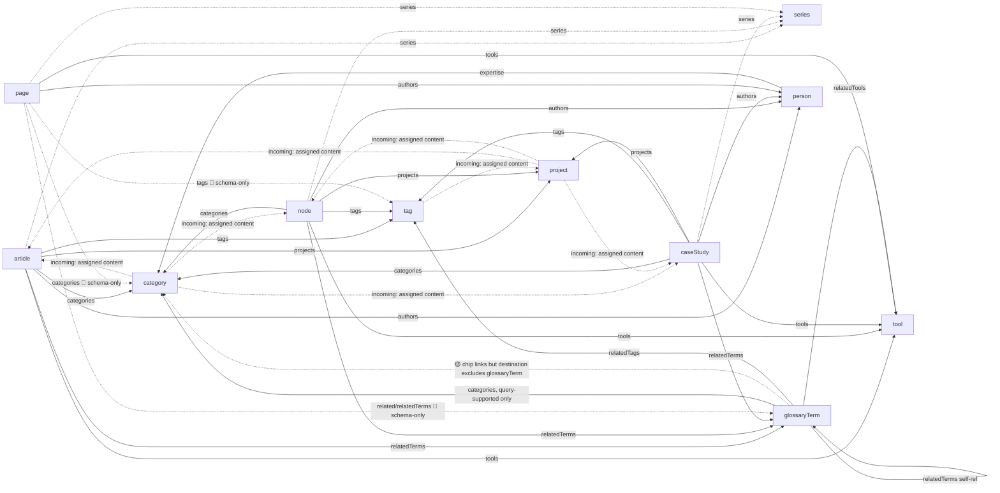
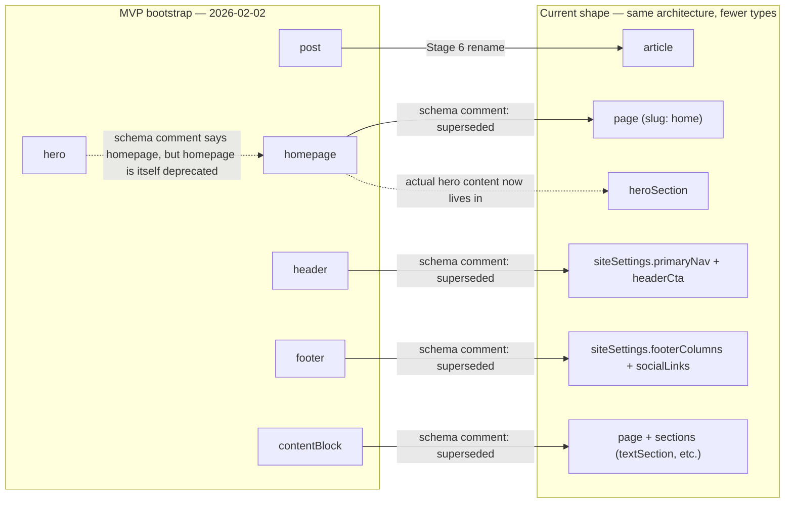
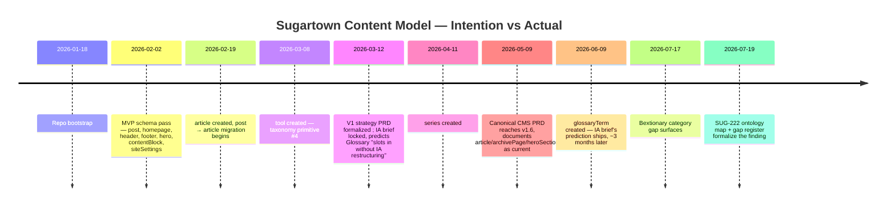

# Sugartown Ontology Map — reverse-engineered reference-edge spec

**Status:** Draft — SUG-222 Phase 0 deliverable
**Owner:** SUG-222 (glossary category display), feeding SUG-221 (Rules & Tools Audit)
**Date:** 2026-07-19

---

## What this is

Sugartown's content ontology — which document types point at which, through which fields, and how far each connection actually got toward a reader — was never written down. It accreted epic by epic. This is the spec that would have preceded the build: every document type and taxonomy primitive as a node, every reference field as an edge, and for each edge, an honest answer to "does this actually work."

**This is not a field inventory.** SUG-163's content-model codegen (`/platform/design-system/content-models`, 11 types / 176 fields) and the `SchemaERD` component already catalogue schema *structure*. This map catalogues *intent and coverage* — of the edges that exist in schema, which ones a GROQ query actually dereferences, and of those, which ones a page component actually renders as something a reader can see or click.

**Trigger:** publishing the "Clicky Burden" Bextionary glossary term (2026-07-17) surfaced a category chip that led nowhere useful — the edge existed in schema and data, a query dereferenced it, but the destination page's *own* query excluded the source type, so it reported "no content" while holding 9 terms. That specific pattern — schema-complete, partially query-supported, not displayed — is exactly what this map exists to catch before the next screenshot finds it.

### Coverage tiers

| Tier | Meaning |
|---|---|
| 🔴 **schema-only** | Field exists in a schema file. No GROQ query in `queries.js` dereferences it (or it returns a raw `_ref` with no expansion). |
| 🟡 **query-supported** | A GROQ query dereferences the field (`field->` or `field[]->`) — data is fetched and shaped — but no page or component visibly renders it. |
| 🟢 **displayed** | A real page or component renders the dereferenced data as visible content (chip, list, link, section). Named below. |
| ⚫ **orphaned** | The *source document type itself* has no query coverage — every field on it is moot regardless of tier, because nothing ever fetches the document. |

### Methodology

Every edge below was sourced directly from `apps/studio/schemas/documents/*.ts`, `apps/studio/schemas/objects/*.ts`, `apps/web/src/lib/queries.js`, and the consuming page/component files — not from a prior audit doc or memory (per the repo's verify-before-citing convention; a stale reference in a convention doc becomes the next session's false starting assumption — see SUG-192). An initial exhaustive pass was run by a research agent across every schema file; the highest-stakes and most surprising claims were independently re-verified by direct grep/read before being recorded here. One correction came out of that verification pass and is noted inline (`siteSettings.footerColumns`). Three edges the agent flagged as uncertain (`richImage.link.internalRef` in body PT, `cardBuilderItem.body` glossary-popover wiring, `project.categories`/`project.tags` render status) were resolved: the `project.categories`/`tags` case is confirmed **displayed** (verified below); the other two remain flagged **unconfirmed** in the gap register rather than stated as fact.

---

## Nodes

**Core content types** — article, node, caseStudy, page, series, archivePage

**Taxonomy primitives** (all keyed on `name`, not `title` — see `docs/conventions/token-naming.md` / MEMORY.md taxonomy-architecture entry) — category, tag, tool, person, project

**Vocabulary** — glossaryTerm (self-referencing via `relatedTerms`; also a PT annotation target via `glossaryTermRef`)

**Site structure / config** — siteSettings, navigation, ctaButtonDoc, preheader

**Deprecated / orphaned** (registered in Studio, zero or near-zero query coverage) — post, header, footer, hero, homepage, contentBlock

---

## Edge outline (by source type)

### article
- `series` → series · single · 🟢 displayed (PageSidebar series nav)
- `related[]` → node \| article \| caseStudy · array · 🟢 displayed (PageSidebar "Related")
- `authors[]` → person · array · 🟢 displayed (MetadataCard byline)
- `projects[]` → project · array · 🟢 displayed (TaxonomyChips)
- `tools[]` → tool · array · 🟢 displayed (MetadataCard/TaxonomyChips, AI-disclosure assembly)
- `categories[]` → category · array · 🟢 displayed (TaxonomyChips, featured category)
- `tags[]` → tag · array · 🟢 displayed (first tag = featured-tag rubric)
- `relatedTerms[]` → glossaryTerm · array · 🟢 displayed (merged with inline PT terms in MetadataCard)
- `relatedProjects[]` → project · array · 🟡 query-supported — deprecated, superseded by `projects[]`, queried but not distinctly consumed

### caseStudy
- Same shape as article: `series`, `authors[]`, `projects[]`, `tools[]`, `categories[]`, `tags[]`, `relatedTerms[]`, `related[]` — all 🟢 displayed
- `relatedProjects[]` → project · 🟡 query-supported — deprecated, superseded by `projects[]`

### node
- Same shape as article: `series`, `authors[]`, `projects[]`, `tools[]`, `categories[]`, `tags[]`, `relatedTerms[]`, `related[]` — all 🟢 displayed
- `relatedProjects[]` → project · 🟡 query-supported — deprecated, superseded by `projects[]`

### page
- `authors[]` → person · single-array · 🟢 displayed
- `tools[]` → tool · array · 🟢 displayed (AI disclosure block)
- `series` → series · single · 🟢 displayed
- `parent` → page (self-ref) · single · 🔴 schema-only — Studio-preview only (`parent.title`); "URL nesting" mentioned in the field description is not implemented in web queries
- `categories[]` → category · array · 🔴 schema-only — field exists, `pageBySlugQuery` omits it entirely (verified directly against the live query)
- `tags[]` → tag · array · 🔴 schema-only — same, omitted from `pageBySlugQuery`
- `projects[]` → project · array · 🔴 schema-only — field is Studio-`hidden: true` **and** unprojected
- `related[]` → node \| article \| caseStudy · array · 🔴 schema-only — schema comment names this a known SUG-210 gap: field only, no GROQ projection, no rendering
- `relatedTerms[]` → glossaryTerm · array · 🔴 schema-only — same SUG-210 gap as `related[]`

### series
- `parts[]` → article \| node \| caseStudy \| page · array · 🟢 displayed (SeriesPage part list); `seriesBySlugQuery` also runs a reverse GROQ lookup (`series._ref == ^._id`) as a fallback, so `content.series → series` is effectively bidirectional at query time even though only one direction is a stored field

### person
- `expertise[]` → category · array · 🟢 displayed ("Expertise" chips, link to `/categories/:slug`)
- *(incoming, computed, not a stored field)* article/node/caseStudy `.authors[]` → person, resolved via `references(^._id)` in `personProfileQuery` · 🟢 displayed

### project
- `tools[]` → tool · array · 🟢 displayed
- `categories[]` → category · array · 🟢 displayed (confirmed: `ProjectDetailPage.jsx` passes `project.categories` into its taxonomy-chip render — the earlier automated pass had flagged this "unknown"; direct grep confirms it renders)
- `tags[]` → tag · array · 🟢 displayed (same confirmation)
- *(incoming, Studio decoration)* article/node/caseStudy → project via `defineIncomingReferenceDecoration` ("Assigned content" panel), bidirectional write-back into `projects[]` on link
- *(incoming, computed)* article/node/caseStudy backrefs rendered as ContentList on `ProjectDetailPage` · 🟢 displayed

### tool
- *(incoming, Studio decoration)* article/node/caseStudy → tool, "Assigned content" panel
- *(incoming, computed)* article/node/caseStudy backrefs → ContentList on `ToolDetailPage` · 🟢 displayed

### category — **the edge this epic exists to fix**
- *(incoming, Studio decoration)* article, node, caseStudy → category, "Assigned content" panel, bidirectional write-back — **glossaryTerm is not in this decoration's `types` list**, so a category document's own Studio view has no way to show which glossary terms reference it
- *(incoming, from glossaryTerm)* see glossaryTerm row below

### tag
- *(incoming, Studio decoration)* article, node, caseStudy, **project** → tag, "Assigned content" panel (tag's decoration list is the one taxonomy primitive that includes `project` alongside article/node/caseStudy)

### glossaryTerm
- `categories[]` → category · array · 🟡 **query-supported, not displayed as intended** — `glossaryTermBySlugQuery` dereferences this and `GlossaryTermPage.jsx` renders it as a chip linking via `getCanonicalPath({docType:'category', slug})` to `/categories/:slug`. **The chip itself is not a dead link** (it correctly uses the URL Authority pattern) — but the destination page's own content query (`contentByTaxonomyQuery`, see below) excludes `glossaryTerm` from its `_type in [...]` list, so the category page renders "No content associated with this category yet" even when 9+ terms reference it. This is the compound failure: display-layer chip is correct, cross-type query enumeration is the actual gap. **Gap register entry #1.**
- `relatedTerms[]` → glossaryTerm (self-ref) · array · 🟢 displayed — schema comment describes this as bidirectional ("adding a term here also adds this term to the target's Related Terms on publish"); the reciprocal-write mechanism is not in the schema files reviewed (likely a Studio document action or Sanity Function outside `schemas/`) — noted, not verified here
- `relatedTags[]` → tag · array · 🟢 displayed
- `relatedTools[]` → tool · array · 🟢 displayed
- `relatedContent[]` → article \| caseStudy \| node \| page \| person \| project \| tool (6 named subtypes) · array · 🟢 displayed via RefRows
- *(annotation target)* `glossaryTermRef` markDef in Portable Text bodies → glossaryTerm · 🟢 displayed where wired (see PT annotation section below) — this is the mechanism SUG-216 fixed for `calloutSection.body`

### siteSettings
- `primaryNav` → navigation · single · 🟢 displayed (Header desktop/mobile nav; Footer also reuses `primaryNav.items`, not `footerColumns`, for its nav columns)
- `headerCta` → ctaButtonDoc · single · 🟢 displayed
- `preheader` → preheader · single · 🟢 displayed
- `footerColumns[]` → navigation · array · 🟢 displayed — **correction from the initial automated pass**, which flagged this as a fully dead edge because `Footer.jsx` never reads it. Direct verification found it *is* consumed — by `DrawerNav.jsx` (the mobile drawer menu), which `Header.jsx` passes it into. Desktop footer and mobile drawer use different nav sources; the edge is real, just not where the first pass looked.
- `footerToolchain[]` → tool · array · 🟢 displayed (Footer tool-chip colophon)

### Portable Text annotations (shared `portableTextConfig`, used across `content[]`/`body[]`/`description[]` fields wherever `standardPortableText`/`summaryPortableText`/`compactPortableText` appear)
- `markDefs.link.internalRef` → page \| article \| caseStudy \| node \| archivePage · 🟢 displayed — the most-reused edge in the schema; resolved via `PT_CONTENT_PROJECTION` and rendered as inline `<a>` by the PortableText serializer components
- `markDefs.glossaryTermRef.term` → glossaryTerm · 🟢 displayed where the containing query includes `PT_CONTENT_PROJECTION` (double-projected: once inline via the markDef, once hoisted to a top-level `inlineTerms` array on article/node/caseStudy queries) — rendered as the dotted-underline hover popover; also the SUG-216 fix point for `calloutSection.body`
- `markDefs.citationRef` — not a reference edge; holds only a numeric footnote index, resolved against a plain-text `citations[]` array

### Internal-link primitive (`linkItem.internalRef`, used by nav items, CTA buttons, gallery images, card builder titles/citations)
- → page \| article \| caseStudy \| node \| archivePage · single · 🟢 displayed — reused across `navItem`, `childNavItem`, `ctaButton`, `cardBuilderItem.titleLink`, `cardBuilderItem.citations[].link`, `galleryImage.link`, `ctaButtonDoc.link`, `preheader.link`

---

## Deprecated / orphaned types — not in the active ontology

These are registered Studio document types with schema-level reference fields that go nowhere on the web, either because the whole type is unqueried or because it was explicitly superseded:

- **`post`** ⚫ orphaned — zero query coverage in `queries.js` (confirmed via grep for `_type == "post"` — no hits). Superseded by `article` per the post → article rename (see MEMORY.md); still carries `authors[]`, `categories[]`, `tags[]`, `projects[]`/`relatedProjects[]` reference fields, all moot.
- **`homepage`** ⚫ orphaned — whole singleton doc type unqueried; its `cards[]` (editorialCard) fields carry no document references anyway (plain URL objects).
- **`header`**, **`hero`**, **`contentBlock`** ⚫ orphaned — superseded by `siteSettings`/`page` sections; no reference-shaped fields of consequence.
- **`footer`** ⚫ orphaned — superseded by `siteSettings.footerColumns` + `primaryNav`; its own `navColumn.links[]`/`socialLinks[]` are URL strings, not document references.

These are flagged for the SUG-221 Rules & Tools Audit housekeeping pass, not remediated here (out of SUG-222 scope — display work, not schema cleanup).

---

## Mermaid — core content ↔ taxonomy graph

Deliberately scoped to the **active** ontology (excludes the orphaned cluster above, which would only add noise). Solid arrows = 🟢 displayed. Dashed arrows = 🟡 query-supported or 🔴 schema-only (labelled). Dotted = incoming/computed backreference.

*(Note: the `glossaryTerm → category` edge is drawn twice deliberately — once as the schema/query edge that exists, once annotated with the specific failure mode this epic fixes. Mermaid doesn't have a clean way to show "half-works" on one arrow.)*

---

## Gap register

Every edge whose coverage tier falls short of plausible intent. Severity is about reader-facing impact; effort is a rough sizing for a future epic, not a commitment. This register is a standing input to SUG-221 Rules & Tools Audit cycles — re-tier on each audit pass rather than letting it go stale.

| # | Edge | Tier found | Tier expected | Severity | Effort | Note |
|---|---|---|---|---|---|---|
| 1 | `glossaryTerm.categories[] → category`, consumed at `/categories/:slug` | 🟡 chip displayed, destination query excludes glossaryTerm | 🟢 fully displayed | **High** | Medium | **This epic's core fix.** `contentByTaxonomyQuery` and all four taxonomy count queries (`allCategoriesQuery`, `allTagsQuery`, `allToolsQuery`, `allProjectsQuery`) use `_type in ["article","node","caseStudy"]` with no `glossaryTerm`. Category page currently false-reports empty for Bextionary (9 terms). |
| 2 | `page.related[]`, `page.relatedTerms[]` → node/article/caseStudy, glossaryTerm | 🔴 schema-only | 🟢 displayed | Medium | Small | Pre-existing named gap (SUG-210 comment in the schema file itself). Not in SUG-222 scope; flagged for its own pickup. |
| 3 | `page.categories[]`, `page.tags[]`, `page.projects[]` → category/tag/project | 🔴 schema-only (`projects[]` also Studio-hidden) | Unclear — may be intentional (pages are structural, not taxonomy-classified content) | Low | — | Needs an intent decision before it's a "gap" at all — record, don't schedule. |
| 4 | `category` incoming-reference decoration `types[]` | excludes `glossaryTerm` | includes `glossaryTerm` | Medium | Small | Studio-side mirror of gap #1 — even after the frontend fix, a category doc's own "Assigned content" panel in Studio still won't show linked glossary terms unless this decoration list is extended. `project`, `tool` decorations have the same exclusion. |
| 5 | `richImage.link.internalRef` inside Portable Text body content | **Unconfirmed** — flagged by automated inventory pass, not independently verified | 🟢 displayed (parity with `markDefs.link`) | Unknown until verified | Small (if real) | `PT_CONTENT_PROJECTION` explicitly resolves `markDefs.link.internalRef` and `markDefs.glossaryTermRef.term` but appears to only special-case `richImage` for image dimensions, not link resolution. Needs a direct check against a real document with a linked `richImage` in body content before treating as a confirmed bug. |
| 6 | `cardBuilderItem.body[]` glossary-popover wiring for nested `glossaryTermRef` marks | **Unconfirmed** | 🟢 displayed (parity with top-level sections) | Unknown until verified | Small (if real) | The shared `PT_CONTENT_PROJECTION` is used, so data should resolve; whether `CardBuilderSection.jsx`'s PortableText renderer actually invokes the glossary-popover component for this specific nested context wasn't confirmed by reading the component. |
| 7 | `article/node/caseStudy.relatedProjects[]` → project | 🟡 query-supported, superseded | — (intentionally deprecated) | Low | — | Not a gap — a known-deprecated field kept for backward compat, per existing convention. Listed for completeness so it isn't mistaken for an unnoticed gap later. |
| 8 | `post`, `homepage`, `header`, `hero`, `footer`, `contentBlock` document types | ⚫ orphaned | — (superseded) | Low (housekeeping) | Medium (multi-type) | Not a display gap — a registry-cleanup item. Feeds SUG-221's housekeeping pass, not a display epic. |

---

## Addendum — original intention vs. current state (added 2026-07-19, at Bex's request)

The "Deprecated / orphaned types" section above documents *that* `post`, `homepage`, `header`, `footer`, `hero`, and `contentBlock` are dead weight today. This addendum documents *why they existed* and *what the project originally intended*, sourced from the founding PRDs rather than inferred — and connects that intention to the newer types (`tool`, `series`, `glossaryTerm`) that arrived after the V1 strategy was written. Bex's read going in: the current shape is "pretty close" to the original intention, and the newer types look like the system working as designed rather than drifting from it. The archaeology below mostly bears that out.

### Sources

- `docs/briefs/sanity/PROJ-001-content-model-strategy-superseded.md` — the original V1 content strategy PRD (curated into `docs/briefs/` 2026-03-12; explicitly superseded by the canonical PRD below, but it's the clearest record of *original intent* because it was never revised to match what got built)
- `docs/briefs/sanity/PROJ-001-sugartown-cms-canonical-prd.md` — the living canonical PRD (reached v1.6 by 2026-05-09), which already documents the *current* shape (`article`, `archivePage`, `heroSection`, `cardBuilderItem`) rather than the MVP shape
- `docs/briefs/ia-brief.md` — the locked IA doc (2026-03-12/15)
- `docs/briefs/wp-freeze-cutover.md` — the WordPress migration cutover checklist
- Every deprecated schema file's own `@deprecated` JSDoc comment — the single most authoritative supersession record, since it's the artifact still shipping in the codebase, not a doc that could have drifted
- Git history (`git log --format=%ad -- <file> | tail -1`) for creation-date archaeology

### Timeline

| Date | Event |
|---|---|
| 2026-01-18 | Repo bootstrap |
| 2026-02-02 | MVP schema pass, all in one push: `post`, `homepage`, `header`, `footer`, `hero`, `contentBlock`, `siteSettings` |
| 2026-02-19 | `article` created — start of the `post` → `article` migration |
| 2026-03-08 | `tool` created — 4th taxonomy primitive, after the original three (`category`/`tag`/`project`) |
| 2026-03-12 | V1 content strategy PRD curated into `docs/briefs/`; IA brief locked the same window — explicitly names **Glossary** as a predicted future addition (see below) |
| 2026-04-11 | `series` created |
| 2026-05-09 | Canonical CMS PRD reaches v1.6, already documenting `article`/`archivePage`/`heroSection`/`cardBuilderItem` as the live shape |
| 2026-06-09 | `glossaryTerm` created — three months after the IA brief predicted it |
| 2026-07-17 | Bextionary category gap surfaces (publishing "Clicky Burden") |
| 2026-07-19 | This ontology map + gap register formalize the finding (SUG-222) |

### What the V1 strategy actually said (2026-02-02 → 2026-03-ish)

The superseded strategy doc frames itself explicitly as **replacing the MVP-only framing**: "The MVP validated that Sanity can power Sugartown's content layer... V1 formalizes... a scalable, future-proof content model." Its stated goals table includes, verbatim, **"Supports future content growth without rework"** as a named success criterion — and separately, "Migration-ready: Schemas support WordPress → Sanity migration with minimal rework." Its architectural principles: *references over strings*, *atomic objects for reuse*, *composable sections*, *validation-first design*, *migration readiness*. Its V1 canonical scope named `node` (knowledge graph), `post`/`page` (publishing), `caseStudy` (portfolio), `category`/`tag`/`project` (taxonomy), `navigation`/`siteSettings` (infrastructure) — no `tool`, no `series`, no `glossaryTerm` yet. Those three didn't exist in the original plan by name; what existed was the *pattern* (reference-based taxonomy, atomic composable objects) that made adding them later a slot-in rather than a rework.

### What replaced what — straight from the schema files

Every MVP-era deprecated type carries an explicit `@deprecated` comment naming its successor. This is a stronger source than any PRD, because it's the thing still shipping:

| MVP type (2026-02-02) | Schema comment's stated successor | Notes |
|---|---|---|
| `post` | *(no `@deprecated` block — instead: `// TODO Stage 6: rename post → article`)* | Migrated from WordPress posts; `wp-freeze-cutover.md` lists "zero documents with `_type === 'post'`" as a cutover-completion checkbox. Canonical PRD, describing `article`: "Replaces the legacy `post` type." |
| `homepage` | `page` document with slug `"home"` | Own comment: "no longer referenced by any web query or component... will be removed in a future version" |
| `header` | `siteSettings.primaryNav` + `siteSettings.headerCta` | |
| `footer` | `siteSettings.footerColumns`, `siteSettings.socialLinks`, etc. | |
| `hero` | *(comment says)* `homepage` schema, via `homepage.title`/`homepage.subtitle` | **Double-deprecated chain**: `hero`'s own comment points at `homepage`, but `homepage` is itself now deprecated in favor of `page`. The functional successor for hero *content* today is `heroSection` (a section type composed into `page.sections[]`), which postdates `hero.ts`'s comment — the comment is accurate to when it was written, stale to the current shape. Worth fixing if anyone revisits schema housekeeping. |
| `contentBlock` | `page` schema + sections (`textSection`, etc.) | |

The consolidation pattern across all five: **many single-purpose singleton document types → fewer document types with composable sections/fields.** That's the "composable sections" and "atomic objects" principle from the V1 strategy being executed, not abandoned.

### The extensibility bet, and whether it held

The IA brief, locked 2026-03-12/15 — roughly three months before `glossaryTerm.ts` was created — named Glossary explicitly as a predicted future addition and made a specific structural claim about it: *"If Reading Lists, Glossary, or Talks are added later, they slot into this dropdown as new items without IA restructuring."* Glossary shipped 2026-06-09. The IA-level prediction held: no nav restructuring was needed to add it.

`tool` (2026-03-08) and `series` (2026-04-11) tell the same story one level down, at the schema layer rather than the IA layer: both adopted the identical reference-based, taxonomy-linked pattern the V1 strategy specified for `category`/`tag`/`project` — no new architectural primitive was invented to accommodate them. That's the "future content growth without rework" goal, measured against what actually happened.

Where the bet *didn't* fully pay off — and this is the honest caveat, not a contradiction — is at the **display layer**, one level below IA and schema: the V1 strategy and the IA brief both operate at "does the type exist and does it fit the navigation," not "does every cross-reference between it and existing types get rendered." `glossaryTerm.categories[]` is exactly that gap: the schema slotted in cleanly (no rework), the IA slotted in cleanly (no restructuring), but the *query layer* connecting it to `category` was never extended — because nothing in either founding document scoped that far down. Gap register entry #1 in the main body of this doc is a display-layer omission, not an architecture failure. The architecture predicted its own extensibility correctly; execution at the query/render layer lagged behind the prediction by about a month (term shipped 2026-06-09, gap surfaced 2026-07-17).

### Mermaid — MVP consolidation

### Mermaid — intention → extensibility timeline

---

## Cross-references

- Structure inventories this map builds on, not duplicates: SUG-163 content-model codegen (`/platform/design-system/content-models`, 11 types / 176 fields), `SchemaERD` component, `docs/conventions/schema-conventions.md`.
- Feeds: SUG-221 Rules & Tools Audit (gap register as a standing re-tiering input; orphaned-type cluster as a housekeeping candidate).
- Planned follow-on (not this epic): a Bex-voice article on reverse-engineering your own ontology, and this map's Mermaid diagram graduating to a `/platform` page via `mermaidSection`, per SUG-166 → SUG-168/169 precedent. Both spin out at this epic's close-out.
