# SUG-224 — Scope Evolution: planned vs found vs revised

**Status:** living document, updated as SUG-217/218/219/230/231 execute and SUG-224 resumes
**Created:** 2026-07-21 (SUG-224 Phase 1 post-mortem)
**Last updated:** 2026-07-21
**Audience:** internal. Not a published surface. If any part of this is ever lifted into a case study, article, or the docs site, run the technical-diagram red-pen gate (CLAUDE.md) against it first.

---

## The diagram

```mermaid
flowchart LR

  subgraph PLAN["1 · ORIGINAL SCOPE, as written 2026-07-17"]
    direction TB
    P1["44 'mirror' components<br/>under apps/web/src/design-system"]
    P2["Replace each with a<br/>re-export from the package"]
    P3["Dedupe CSS modules<br/>package copy becomes the only copy"]
    P4["Retire the Mirrored File Registry row<br/>+ upgrade the diagram arrow to solid"]
    P1 --> P2 --> P3 --> P4
    PNOTE["Stated: 'Upstream dependencies: none blocking'<br/>Stated: no DS API changes<br/>Phase 1 proof component: Card"]
  end

  subgraph FOUND["2 · WHAT PHASE 1 FOUND, read-only audit 2026-07-21"]
    direction TB

    F0["The 44 are not mirrors.<br/>Verified by reading every pair."]

    F1["26 PURE MIRROR<br/>safe to re-export"]
    F2["6 ADAPTER<br/>Breadcrumb Button Card Chip IndexCell Media"]
    F3["6 DIVERGED<br/>Accordion Callout CodeBlock Container FilterBar Stack"]
    F4["6 WEB-ONLY<br/>Grid PageHeader SectionLabel Sidebar SidebarNav Tile"]

    F0 --> F1 & F2 & F3 & F4

    F1A["BUT 4 of the 26 have drifted CSS<br/>Citation ScoreRing Table IconButton<br/>→ only 22 are safe today"]
    F2A["BLOCKER 1 · no link seam<br/>package hard-codes a-href<br/>re-export breaks SPA navigation<br/>fixing it needs a DS API change<br/>the epic's Non-Goals forbid"]
    F3A["2 LIVE BUGS<br/>FilterBar clear-all missing<br/>CodeBlock showLineNumbers inert"]
    F4A["No package equivalent exists.<br/>Cannot be re-exported at all."]

    F1 --> F1A
    F2 --> F2A
    F3 --> F3A
    F4 --> F4A

    F5["BLOCKER 2 · structural-closure AC<br/>unachievable for 15 of 44"]
    F6["BLOCKER 3 · SUG-217/218/219<br/>are real prerequisites"]
    F2A --> F5
    F4A --> F5
    F1A --> F6

    FX["Corrections: zero 'use client' directives exist<br/>3 components missing from the package barrel<br/>Card was the worst possible spike candidate"]
  end

  subgraph FINAL["3 · REVISED PLAN, four epics with three in parallel"]
    direction TB

    R1["SUG-217 / 218 / 219<br/>CSS mirror reconciliation<br/>status: backlog"]
    R2["SUG-230 · DS link seam<br/>injectable link component<br/>status: backlog, NOT blocked"]
    R3["SUG-231 · JS divergence<br/>incl. the 2 live bugs<br/>status: backlog, NOT blocked"]

    R4["SUG-224 · revised<br/>1 · amend Scope/AC/Non-Goals<br/>2 · re-run the pair classification<br/>3 · spike a pure mirror, not Card<br/>4 · consume built dist via exports map"]

    R1 --> R4
    R2 --> R4
    R3 -.->|"reduces scope,<br/>not blocking"| R4

    R5["Outcome: apps/web consumes the package.<br/>Registry row retired for the converted set.<br/>Diagram arrow becomes solid."]
    R4 --> R5
  end

  PLAN ==>|"audit"| FOUND
  FOUND ==>|"re-scope"| FINAL

  classDef wrong fill:#ffe8e8,stroke:#c0392b,stroke-width:2px,color:#111
  classDef bug fill:#ffd9d9,stroke:#8e1b1b,stroke-width:3px,color:#111
  classDef ok fill:#e8f6ec,stroke:#1e7a3c,stroke-width:2px,color:#111
  classDef plan fill:#eef1f6,stroke:#5a6a85,stroke-width:1px,color:#111

  class PNOTE,F2A,F5,F6,FX wrong
  class F3A,F1A bug
  class R5 ok
  class P1,P2,P3,P4 plan
```

---

## Claim table

Every assertion the diagram makes, and what backs it. Classes follow CLAUDE.md's technical-diagram red-pen convention.

| Diagram element | Evidence | Class |
|---|---|---|
| "44 mirror components" (original scope) | `docs/backlog/SUG-224-*.md` §Scope as authored 2026-07-17 | measured (quotes the epic doc as written) |
| 26 pure / 6 adapter / 6 diverged / 6 web-only | Full read of all 38 pairs + 6 web-only dirs, 2026-07-21; recorded in SUG-224 §Phase 1 Findings | measured |
| "package hard-codes a-href, no link seam" | `packages/design-system/src/components/Card/Card.tsx` lines 221–382, `Chip.tsx` line 126; zero router imports in `packages/design-system/src/` (grep) | enforced-by-code |
| "re-export breaks SPA navigation" | apps/web uses `react-router-dom` `<Link>` in Card/Chip/Button/Breadcrumb/IndexCell; `<a href>` triggers a document load | enforced-by-code |
| "fixing it needs a DS API change the Non-Goals forbid" | SUG-224 §Non-Goals: "No visual or API changes to any DS component" | convention (quotes the epic's own text) |
| 4 pure mirrors with drifted CSS (Citation, ScoreRing, Table, IconButton) | `KNOWN_DRIFT` in `apps/web/scripts/validate-style-mirror.js`, cross-referenced against the pair classification | enforced-by-code |
| FilterBar clear-all missing | `apps/web/src/design-system/components/FilterBar/FilterBar.jsx`: no `filterHeader`/`clearAllButton`; `onClearAll` carries an `eslint-disable-next-line no-unused-vars` | enforced-by-code |
| CodeBlock `showLineNumbers` inert | web `CodeBlock.jsx` never imports `prismjs/plugins/line-numbers`; package `CodeBlock.tsx` does | enforced-by-code |
| "zero 'use client' directives exist" | `grep -rln '"use client"' packages/design-system/src/` → 0 results | measured |
| 3 components missing from barrel | `packages/design-system/src/index.ts`: no Breadcrumb/ButtonGroup/IconButton export | enforced-by-code |
| "SUG-230 NOT blocked / runs parallel" | Link seam is API/render work; SUG-217/218/219 are CSS-only. No file-level conflict on the same axis | convention (a scoping judgement, not a machine guarantee) |
| SUG-224 revised steps 1–4 | SUG-224 §Phase 1 Findings → Resume checklist; consumption decision recorded same section | convention |
| "Outcome: registry row retired for the converted set" | **roadmap**: not true yet, and deliberately narrowed from the original "retire the row" since web-only + adapter components may still need mirroring | roadmap |

**One element is roadmap, not current state:** the final outcome box. Everything in panel 3 describes planned work; only panels 1 and 2 describe things that are true today.

---

## How to update this document

This diagram is expected to change as the surrounding epics execute. When updating:

1. **Panel 2 is a historical snapshot**: it records what the 2026-07-21 audit found. Do not silently revise it as things get fixed; instead strike through resolved items and note the epic that resolved them, so the record of *why the epic was re-scoped* survives.
2. **Panel 3 tracks live status**: update each epic's status line as it ships, and move `SUG-224 · revised` forward as its prerequisites clear.
3. **Re-run the pair classification before trusting panel 2's counts again.** They are dated. SUG-217/218/219/230/231 all change them.
4. **Update the claim table in the same edit.** A diagram element whose evidence cell goes stale is exactly the failure this table exists to prevent.
5. If any panel is ever lifted into published content, run the full technical-diagram red-pen gate (CLAUDE.md §Technical diagram red-pen gate). This internal claim table is a lighter-weight version of it.

## Changelog

- **2026-07-21**: created from SUG-224's Phase 1 post-mortem. All three panels initial state; SUG-230 and SUG-231 newly created and unstarted.
